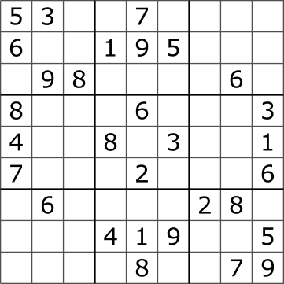

# Sudoku Solver

[Sudoku] is a number-based puzzle game. Sudoku is a simple little game with few rules,
which gives us a good place to show off how ddlog can be used to solve analysis problems.

Sudoku consists of a 9x9 grid of cells, with the whole 9x9 grid being split into nine 3x3 grids.
Each individual cell can hold a number or nothing, which leaves us with something like this



The rules of Sudoku are simple, and there's only four of them:

1. Each cell must contain a number between 1 and 9
2. Each horizontal row of cells must contain each number exactly once
3. Each vertical column of cells must contain each number exactly once
4. Each 3x3 sub-grid must contain each number exactly once

With this little framework we now have everything we need to implement sudoku solving in ddlog!

Before we get to anything else, let's take advantage of ddlog's strong typing by making
some wrapper types so that we can make sure everything is nice and type safe. We'll make
types for rows, columns and cells so that we can't mix up rows and columns, potentially
preventing some nasty little bugs

```ddlog
typedef Row = Row { n: usize }
typedef Col = Col { n: usize }

typedef Cell = Cell { row: Row, col: Col }
```

Now we need a way for the user to tell us what the initially filled cells of the board are,
for this we'll use an [input relation] of `Cell`s

```ddlog
input relation InitialCells(cell: Cell)
```

[Sudoku]: https://en.wikipedia.org/wiki/Sudoku
